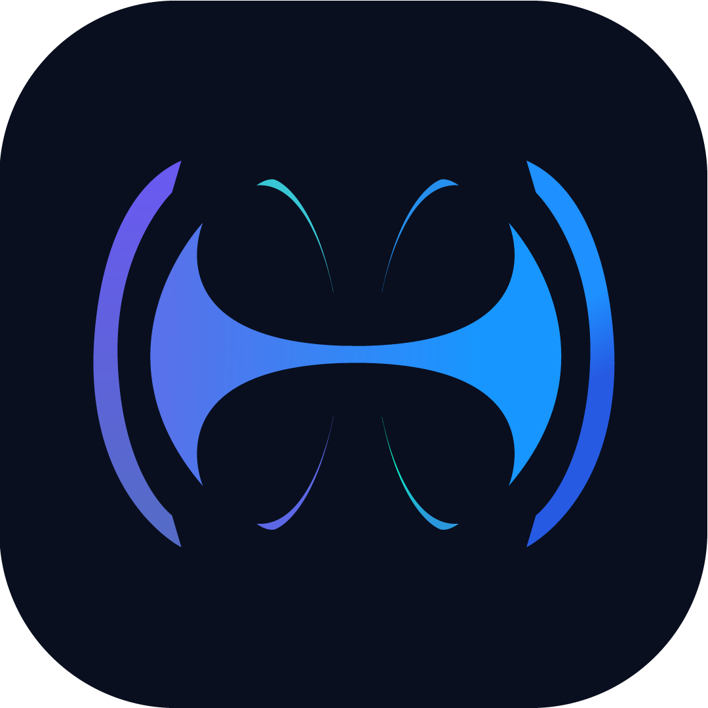

---
hide:
  - navigation
  - toc
---

<h1>📚 Documentação da Plataforma Vortex</h1>

    <figure>
        
        <figcaption>Plataforma de Coleta de Dados Industriais</figcaption>
    </figure>

## 🚀 Bem-vindo à Plataforma Vortex

A Plataforma Vortex é uma solução completa e robusta para **coleta, processamento e armazenamento de dados industriais** em tempo real. Desenvolvida especificamente para ambientes de automação industrial, oferece uma arquitetura de microsserviços escalável e confiável.

## 🏗️ Componentes da Plataforma

-   :material-server:{ .lg .middle } **Vortex Server**

    ---

    O **núcleo orquestrador** da plataforma, responsável por coordenar todos os microsserviços, descobrir coletores automaticamente e processar filas de mensagens.

    [:octicons-arrow-right-24: Documentação do Server](vortex_server/index.md)

-   :material-antenna:{ .lg .middle } **Vortex Collector**

    ---

    O **componente de coleta** que se comunica com equipamentos industriais via protocolos OPC DA, coletando dados em tempo real de PLCs e sensores.

    [:octicons-arrow-right-24: Documentação do Collector](vortex_collector/index.md)

-   :material-api:{ .lg .middle } **Vortex API**

    ---

    A **interface de programação** que permite configuração e gerenciamento de todos os componentes da plataforma via API RESTful.

    [:octicons-arrow-right-24: Documentação da API](vortex_api/index.md)

## 🛠️ Tecnologias Principais

-   **.NET 9**

    Framework principal utilizado em todos os componentes

-   **PostgreSQL**

    Banco de dados relacional para configurações

-   **QuestDB**

    Banco de dados time series para dados coletados

-   **RabbitMQ**

    Broker de mensagens para comunicação entre componentes

-   **OPC DA**

    Protocolo de comunicação com equipamentos industriais

-   **Docker**

    Containerização para deployment simplificado

## 🎯 Para Quem é Esta Documentação

=== "👨‍💼 Administradores"

    **Você é responsável pela infraestrutura?**

    - Guias completos de instalação e configuração
    - Procedimentos de manutenção e backup
    - Troubleshooting e resolução de problemas
    - Monitoramento e performance

=== "👨‍💻 Desenvolvedores"

    **Você precisa integrar com a plataforma?**

    - Documentação completa da API REST
    - Exemplos de código e integração
    - Diagramas de arquitetura
    - Especificações técnicas detalhadas

=== "🔧 Operadores"

    **Você opera o sistema no dia a dia?**

    - Guias de operação diária
    - Interpretação de logs e alertas
    - Procedimentos de recuperação
    - Manutenção preventiva

## 🚀 Início Rápido

!!! tip "Sequência Recomendada de Instalação"

    1. **[Vortex Server](vortex_server/index.md)** - Configure primeiro o servidor principal
    2. **[Vortex API](vortex_api/index.md)** - Configure a API para gerenciamento
    3. **[Vortex Collector](vortex_collector/index.md)** - Deploy os coletores nos equipamentos

## 📞 Suporte

!!! question "Precisa de ajuda?"

    - **📖 Documentação**: Consulte esta documentação completa
    - **🔍 Logs**: Verifique os logs detalhados de cada componente
    - **📊 Monitoramento**: Utilize as ferramentas de monitoramento integradas

---

    <small>
        **Desenvolvido por**: Henrique Morais | **Copyright**: © Veter Engineering
    </small>

