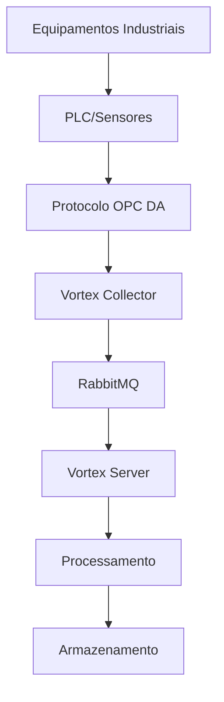
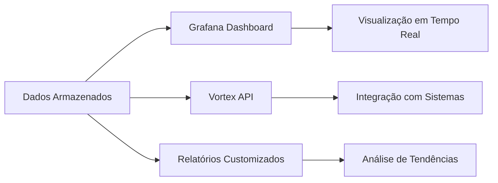

# 💼 Proposta Comercial - Vortex Server

  
  <h2 style="margin: 1rem 0 0.5rem 0; font-size: clamp(1.5rem, 4vw, 2.5rem);">Transforme sua Indústria com Inteligência de Dados</h2>
  
Solução completa para coleta, processamento e análise de dados industriais em tempo real

## 🎯 Visão Geral da Solução

O **Vortex Server** é a solução completa para **coleta, processamento e análise de dados industriais** em tempo real. Nossa plataforma oferece uma arquitetura robusta e escalável que permite às empresas industriais extrair valor máximo de seus equipamentos e processos.

### Por que Escolher o Vortex Server?

-   :material-lightning-bolt:{ .lg .middle } **Tempo Real**

    ---

    Coleta e processamento de dados em tempo real com latência ultra-baixa, garantindo decisões rápidas e precisas.

-   :material-shield-check:{ .lg .middle } **Confiabilidade**

    ---

    Arquitetura robusta com alta disponibilidade e recuperação de falhas em segundos.

-   :material-chart-line:{ .lg .middle } **Escalabilidade**

    ---

    Cresce com seu negócio. Suporte a milhares de pontos de dados e múltiplos sites industriais.

-   :material-cog:{ .lg .middle } **Facilidade de Uso**

    ---

    Interface intuitiva e configuração simplificada. Operação sem necessidade de especialistas técnicos.

## 🏭 Fluxo Completo do Produto

### 1. Coleta de Dados Industriais

**Características da Coleta:**
- ✅ Suporte a protocolos industriais padrão (OPC DA)
- ✅ Descoberta automática de equipamentos
- ✅ Coleta contínua 24/7 sem interrupções
- ✅ Tolerância a falhas de rede e equipamentos

## 🎬 Demonstração da Arquitetura

<video width="800" height="450" controls style="border-radius: 8px; box-shadow: 0 4px 8px rgba(0,0,0,0.1);">
  <source src="../assets/arquitetura.mp4" type="video/mp4">
  Seu navegador não suporta vídeos HTML5.
</video>

<em>Demonstração da arquitetura Vortex Server</em>

### 2. Processamento e Orquestração

O **Vortex Server** atua como o cérebro da operação:

-   :material-magnify:{ .lg .middle } **Descoberta Automática**

    ---

    Identifica automaticamente novos coletores e equipamentos na rede industrial.

-   :material-sync:{ .lg .middle } **Orquestração Inteligente**

    ---

    Coordena múltiplos coletores e otimiza o fluxo de dados em tempo real.

-   :material-filter:{ .lg .middle } **Processamento Avançado**

    ---

    Filtra, valida e transforma dados.

-   :material-alert:{ .lg .middle } **Alertas Inteligentes**

    ---

    Sistema de alertas configurável baseado em regras de negócio.

### 3. Armazenamento Otimizado

**Arquitetura Híbrida de Dados:**

| Tipo de Dados | Banco de Dados | Benefícios |
|---------------|----------------|------------|
| **Configurações** | PostgreSQL | Transações ACID, integridade referencial |
| **Dados Temporais** | InfluxDB | Alta performance, análise de séries temporais |
| **Métricas** | Grafana | Visualização e análise de dados em tempo real |

### 4. Visualização e Análise

## 🚀 Casos de Uso Principais

-   :material-monitor:{ .lg .middle } **Monitoramento de Equipamentos Críticos**

    ---

    **Desafio:** Falhas inesperadas em equipamentos críticos causam paradas custosas.

    **Solução Vortex:**
    - Monitoramento contínuo de temperatura, vibração, pressão
    - Alertas baseados em padrões históricos
    - Manutenção preventiva programada

    **Resultado:** Redução nas falhas críticas.

-   :material-cog:{ .lg .middle } **Otimização de Processos de Produção**

    ---

    **Desafio:** Processos industriais com baixa eficiência e desperdício de recursos.

    **Solução Vortex:**
    - Análise em tempo real de parâmetros de processo
    - Identificação de gargalos e oportunidades de melhoria
    - Controle automático de variáveis críticas

    **Resultado:** Aumento na eficiência de produção.

-   :material-leaf:{ .lg .middle } **Gestão de Energia e Sustentabilidade**

    ---

    **Desafio:** Alto consumo energético e necessidade de redução de pegada de carbono.

    **Solução Vortex:**
    - Monitoramento detalhado do consumo energético
    - Identificação de picos de consumo e desperdícios
    - Otimização automática de cargas

    **Resultado:** Redução no consumo energético.

## 💡 Próximos Passos

-   :material-presentation:{ .lg .middle } **Demonstração Personalizada**

    ---

    Agende uma demonstração personalizada para sua indústria:
    - Análise de seus equipamentos atuais
    - Simulação com seus dados reais
    - Apresentação de casos similares ao seu

-   :material-test-tube:{ .lg .middle } **Prova de Conceito (POC)**

    ---

    Implementação piloto em ambiente controlado:
    - Duração: 30 dias
    - Equipamentos: Até 10 pontos de dados
    - Suporte técnico completo incluído

-   :material-file-document:{ .lg .middle } **Proposta Comercial Detalhada**

    ---

    Após a POC, apresentaremos:
    - Proposta comercial personalizada
    - Cronograma de implementação
    - Plano de treinamento e suporte

## 📞 Contato Comercial

  
  <h3 style="margin: 0 0 1rem 0; color: white;">🚀 Pronto para transformar sua indústria?</h3>
  
  

    <a href="mailto:comercial@veter.com.br" style="display: inline-block; padding: 1rem 2rem; background: rgba(255,255,255,0.2); color: white; text-decoration: none; border-radius: 8px; font-weight: bold; transition: all 0.3s ease;">
      📞 Fale Conosco - Contato Comercial
    </a>
  

  
  

    <strong>Veter Engineering</strong> 
    <em>Especialistas em Automação Industrial</em>
  

  

---

    <small style="color: #6c757d;">
        <strong>Vortex Server</strong> - Transformando dados industriais em vantagem competitiva 
        © 2024 Veter Engineering. Todos os direitos reservados.
    </small>

